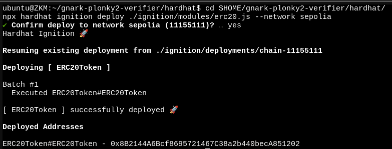
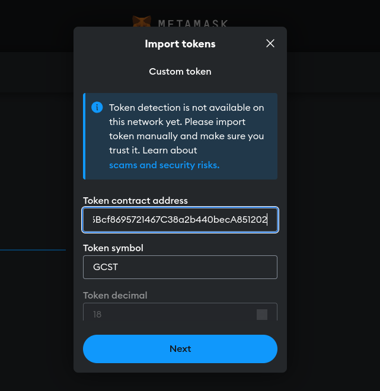
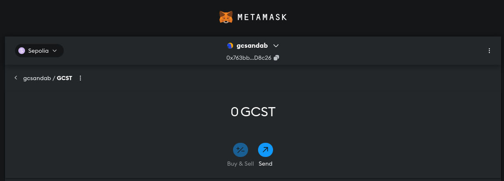
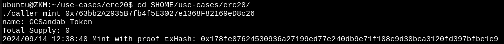
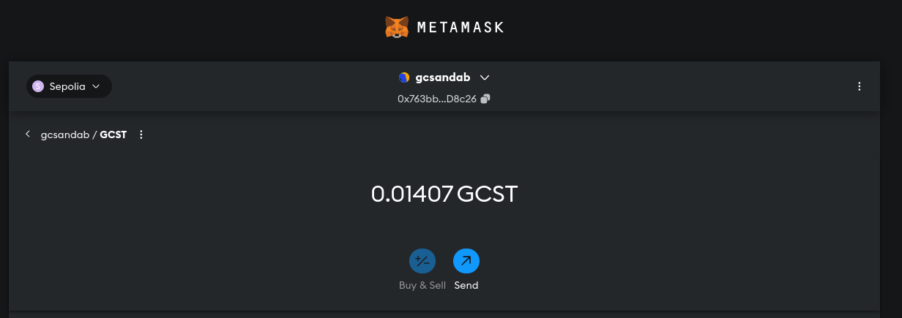

# BUILDH3R_Sept_ZKM
- Discord Link for Use-Case: [https://discord.com/channels/1125877344972849232/1284487425766326367](https://discord.com/channels/1125877344972849232/1284487425766326367)
- [Use-Case Docs](./Discord-Use-Case.md) 

## System Setup
- I am using Local VM with Hardware Spec:
  - 32 GB RAM
  - 16 vCPU
  - 60GB SSD

-  Install `rust` locally. Below command will install cli. [More deatils](https://www.rust-lang.org/tools/install)
    ```sh
    curl --proto '=https' --tlsv1.2 -sSf https://sh.rustup.rs | sh
    rustup install nightly
    rustup default nightly
    rustc --version
    ```
- Install Go `v1.22.5`. Below command will install cli. [More deatils](https://www.rust-lang.org/tools/install)
    ```sh
    cd /tmp
    wget https://go.dev/dl/go1.22.5.linux-amd64.tar.gz
    sudo rm -rf /usr/local/go && sudo tar -C /usr/local -xzf go1.22.5.linux-amd64.tar.gz
    export PATH=$PATH:/usr/local/go/bin
    sudo rm -rf /tmp/go1.22.5.linux-amd64.tar.gz
    ```

## ENV:
- Setup Local ENV
  ```sh
  export RUST_LOG=info
  export BASEDIR=/home/ubuntu/zkm # Replace with your folder location
  export SEG_SIZE=262144 # See cycles above for exact value based on your RAM
  export ARGS='<redacted> <redacted>'
  export ELF_PATH=$BASEDIR/prover/examples/sha2-go/sha2-go
  export SEG_OUTPUT=/tmp/output
  export SEG_FILE_DIR=/tmp/output
  export PRIVATE_KEY=<redacted>
  ```

- Include `0x` prefix in `PRIVATE_KEY` value.

## Clone Repo


# Proof Generate
- [ZKM Github Repo](https://github.com/zkMIPS/zkm):
  ```sh
  cd $HOME && git clone https://github.com/zkMIPS/zkm.git
  cd zkm && rm -rf .git 
  ```

- Steps:

  ```sh
  cd $BASEDIR
  GOOS=linux GOARCH=mips GOMIPS=softfloat go build -C prover/examples/sha2-go/
  export ELF_PATH=prover/examples/sha2-go/sha2-go
  HOST_PROGRAM=sha2_go cargo run --release --example zkmips prove_host_program
  ```
- Command `HOST_PROGRAM=sha2_go cargo run --release --example zkmips prove_host_program` will take some times according to Hardware Spec.
- Output on success:
  - 3 files inside `$HOME/verifier/data/test_circuit/` are `common_circuit_data.json`, `proof_with_public_inputs.json` and `verifier_only_circuit_data.json`.


# Proof Verification

## Convert plonky2 proof to groth16 proof
- Command:
  ```sh
  cd $HOME && git clone https://github.com/zkMIPS/gnark-plonky2-verifier.git
  cd $HOME/gnark-plonky2-verifier && rm -rf .git
  cp $HOME/verifier/data/test_circuit/* testdata/mips
  go build benchmark.go
  ./benchmark
  ```
- Output on success:
  - 3 files inside `$HOME/gnark-plonky2-verifier/testdata/mips/` are `verifying.key`, `proof.proof` and `snark_proof_with_public_inputs.json`.

- Save in different folder.
	```sh
	mkdir -p $HOME/verifier/plonky2-groth16
	cp $HOME/gnark-plonky2-verifier/testdata/mips/{verifying.key,proof.proof,snark_proof_with_public_inputs.json} $HOME/verifier/plonky2-groth16/
	```

## Generate the on chain verification contract
- We will use [ERC20 Mint](https://github.com/zkMIPS/use-cases/tree/main/erc20) use-case
- Setup Script:
  ```sh
  #!/bin/bash

  cd $HOME
  git clone https://github.com/zkMIPS/use-cases.git && cd $HOME/use-cases/erc20/hardhat/ && rm -rf .git ignition/deployments artifacts cache
  rm -rf $HOME/gnark-plonky2-verifier/hardhat
  cp -r $HOME/use-cases/erc20/hardhat $HOME/gnark-plonky2-verifier/hardhat && mkdir -p $HOME/gnark-plonky2-verifier/hardhat/test
  cd $HOME/gnark-plonky2-verifier/hardhat && npm install
  cat > $HOME/gnark-plonky2-verifier/hardhat/hardhat.config.js << EOF
  require("@nomicfoundation/hardhat-toolbox");

  const deployerPrivateKey =
  process.env.PRIVATE_KEY ?? "0xac0974bec39a17e36ba4a6b4d238ff944bacb478cbed5efcae784d7bf4f2ff80";

  /** @type import('hardhat/config').HardhatUserConfig */
  module.exports = {
  solidity: "0.8.24",
  defaultNetwork: "localhost",
  networks: {
      hardhat: {
      },
      // example
      sepolia: {  
        url: "https://eth-sepolia.g.alchemy.com/v2/RH793ZL_pQkZb7KttcWcTlOjPrN0BjOW",  
        accounts: [deployerPrivateKey],  
        chainId: 11155111,
        gasPrice: 1000000000,
      }
    }
  }
  EOF
  cd $HOME/gnark-plonky2-verifier
  go build gnark_sol_caller.go
  ./gnark_sol_caller generate --outputDir hardhat/contracts
  cat > $HOME/gnark-plonky2-verifier/hardhat/test/Verifier.js << EOF
  const fs = require('fs');
  const { expect } = require("chai");
  const { ethers } = require('hardhat');
    
  describe('Verifier', function () {  
      let verifier;
      let signer;
    
      before(async function () {  
          const VerifierFactory = await ethers.getContractFactory('Verifier');  
          verifier = await VerifierFactory.deploy();
          // console.log(verifier);
          // await verifier.deployed();
          [signer] = await ethers.getSigners();
      });
    
      it('Should submit a proof', async function () {  
          const data = JSON.parse(fs.readFileSync('./test/snark_proof_with_public_inputs.json', 'utf8'));  
          const commitmentX = ethers.getBigInt(data['Proof']['Commitments'][0]['X']); 
          const commitmentY = ethers.getBigInt(data['Proof']['Commitments'][0]['Y']); 
          const commitments = [commitmentX, commitmentY];
          const uint256input = data['PublicWitness'].map((numStr) => ethers.getBigInt(numStr)); 
          const aPoint = {  
              X: ethers.getBigInt(data['Proof']['Ar']['X']),  
              Y: ethers.getBigInt(data['Proof']['Ar']['Y'])  
          };
    
          const bPoint = {
              X: [ethers.getBigInt(data['Proof']['Bs']['X']['A0']), ethers.getBigInt(data['Proof']['Bs']['X']['A1'])], 
              Y: [ethers.getBigInt(data['Proof']['Bs']['Y']['A0']), ethers.getBigInt(data['Proof']['Bs']['Y']['A1'])] 
          };
          
          const cPoint = {  
              X: ethers.getBigInt(data['Proof']['Krs']['X']),  
              Y: ethers.getBigInt(data['Proof']['Krs']['Y'])  
          };
    
          const proof = {
              a: { ...aPoint }, 
              b: { ...bPoint },  
              c: { ...cPoint }
          };  
    
          const result = await verifier.verify(uint256input, proof, commitments);
          expect(result).to.equal(0);

          // const tx = await verifier.connect(signer).verifyTx(proof, uint256input, commitments);  
          // console.log(tx);        
      });  
  });
  EOF
  cp $HOME/gnark-plonky2-verifier/testdata/mips/snark_proof_with_public_inputs.json $HOME/gnark-plonky2-verifier/hardhat/test/snark_proof_with_public_inputs.json
  ```

- Modify `Token Name` and `Token Symbol` in `$HOME/gnark-plonky2-verifier/hardhat/contracts/erc20.sol`:
  ```sh
  constructor()  {
      _name = "<Token Name>";
      _symbol = "<Token Symbol>";
      _decimals = 18;
      _totalSupply = 0;
      _verifier = new Verifier();
  }
  ```

- In my case:
  ```sh
  constructor()  {
      _name = "Final Test Token";
      _symbol = "FTT";
      _decimals = 18;
      _totalSupply = 0;
      _verifier = new Verifier();
  }
  ```

- Compile contract:
  ```sh
  #!/bin/bash     
  cd $HOME/gnark-plonky2-verifier/hardhat/
  rm -rf ignition/deployments artifacts cache
  npx hardhat compile || { echo "Failed to compile"; exit 1; }
  npx hardhat node &
  sleep 5
  HARDHAT_NODE_PID=$(ss -tulpn | grep :8545 | awk '{print $7}' | cut -d',' -f2 | cut -d'=' -f2)
  npx hardhat test || { 
  echo "Tests failed"; 
  kill -9 $HARDHAT_NODE_PID
  exit 1 
  }
  kill -9 $HARDHAT_NODE_PID
  wait $HARDHAT_NODE_PID 2>/dev/null
  echo "Hardhat node stopped"
  ```

## Deploy Verifier Contract:
- Make sure wallet contains some ETH to deploy contract.
- Command:
  ```sh
  cd $HOME/gnark-plonky2-verifier/hardhat/
  npx hardhat ignition deploy ./ignition/modules/erc20.js --network sepolia
  ```
- Output:
    <details><summary> Detailed Output </summary><blockquote>

    ~~~
	ubuntu@ZKM:~/gnark-plonky2-verifier/hardhat$ cd $HOME/gnark-plonky2-verifier/hardhat/
	npx hardhat ignition deploy ./ignition/modules/erc20.js --network sepolia
	✔ Confirm deploy to network sepolia (11155111)? … yes
	Hardhat Ignition 🚀

	Resuming existing deployment from ./ignition/deployments/chain-11155111

	Deploying [ ERC20Token ]

	Batch #1
	Executed ERC20Token#ERC20Token

	[ ERC20Token ] successfully deployed 🚀

	Deployed Addresses

	ERC20Token#ERC20Token - 0x8B2144A6Bcf8695721467C38a2b440becA851202
    ~~~

    </blockquote></details>
    

### Verify Contract:
- Command:
  ```sh
  cd $HOME/gnark-plonky2-verifier
  ./gnark_sol_caller verify 0x8B2144A6Bcf8695721467C38a2b440becA851202
  ```
- Output:
    <details><summary> Detailed Output </summary><blockquote>

    ~~~
	ubuntu@ZKM:~/gnark-plonky2-verifier/hardhat$ cd $HOME/gnark-plonky2-verifier
	./gnark_sol_caller verify 0x8B2144A6Bcf8695721467C38a2b440becA851202
	2024/09/14 12:34:01 verify proof txHash: 0xe80fcb8bbe2bac457fe5004b7ea5737d9098eec95aa0f53d33bd264b64652d15
    ~~~

    </blockquote></details>

- Txn: `0xe80fcb8bbe2bac457fe5004b7ea5737d9098eec95aa0f53d33bd264b64652d15`
- Link: [https://sepolia.etherscan.io/tx/0xe80fcb8bbe2bac457fe5004b7ea5737d9098eec95aa0f53d33bd264b64652d15](https://sepolia.etherscan.io/tx/0xe80fcb8bbe2bac457fe5004b7ea5737d9098eec95aa0f53d33bd264b64652d15)


# Perform On-Chain Action
- Here, we wiill mint ERC20 Token.
- Import `0x8B2144A6Bcf8695721467C38a2b440becA851202` contract into Metamask wallet:

    

- Default Token Count is `0`:

    

- Command:
  ```sh
  cd $HOME/use-cases/erc20/
  rm -rf hardhat
  cp -r $HOME/gnark-plonky2-verifier/hardhat $HOME/use-cases/erc20/
  cp $HOME/gnark-plonky2-verifier/testdata/mips/{verifying.key,snark_proof_with_public_inputs.json} $HOME/use-cases/erc20/verifier/
  ```

- Replace `$HOME/use-cases/erc20/caller.go` with below content:
    <details><summary> Detailed Output </summary><blockquote>

    ~~~
    package main

    import (
            "bytes"
            "encoding/json"
            "flag"
            "fmt"
            "io"
            "log"
            "math/big"
            "os"
            "path/filepath"
            "text/template"

            "erc20/token"

            "github.com/consensys/gnark-crypto/ecc"
            "github.com/consensys/gnark/backend/groth16"
            groth16_bn254 "github.com/consensys/gnark/backend/groth16/bn254"
            "github.com/ethereum/go-ethereum/accounts/abi/bind"
            "github.com/ethereum/go-ethereum/common"
            "github.com/ethereum/go-ethereum/crypto"
            "github.com/ethereum/go-ethereum/ethclient"
    )

    type ProofPublicData struct {
            Proof struct {
                    Ar struct {
                            X string
                            Y string
                    }
                    Krs struct {
                            X string
                            Y string
                    }
                    Bs struct {
                            X struct {
                                    A0 string
                                    A1 string
                            }
                            Y struct {
                                    A0 string
                                    A1 string
                            }
                    }
                    Commitments []struct {
                            X string
                            Y string
                    }
            }
            PublicWitness []string
    }

    type Receipt struct {
            proof           token.Proof
            input           [65]*big.Int
            proofCommitment [2]*big.Int
    }

    var ChainId int64
    var Network string
    var HexPrivateKey string

    func main() {
            // Initialize flags
            chainId := flag.Int64("chainId", 11155111, "chainId")
            network := flag.String("network", "https://eth-sepolia.g.alchemy.com/v2/RH793ZL_pQkZb7KttcWcTlOjPrN0BjOW", "network")
            privateKey := flag.String("privateKey", os.Getenv("PRIVATE_KEY"), "privateKey")
            erc20TokenAddr := flag.String("erc20TokenAddr", os.Getenv("ERC20_TOKEN_ADDR"), "erc20TokenAddr")
            outputDir := flag.String("outputDir", "hardhat/contracts", "outputDir")
            proofPath := flag.String("proofPath", "./hardhat/test/snark_proof_with_public_inputs.json", "proofPath")
            flag.Parse()

            // Set default values if necessary
            if *privateKey == "" {
                    *privateKey = "df4bc5647fdb9600ceb4943d4adff3749956a8512e5707716357b13d5ee687d9"
            }
            if *erc20TokenAddr == "" {
                    *erc20TokenAddr = "0xA234F9049720EDaDF3Ae697eE8bF762f2A03949A"
            }

            // Set global variables
            ChainId = *chainId
            Network = *network
            HexPrivateKey = *privateKey

            if len(os.Args) < 2 {
                    log.Printf("expected subcommands")
                    os.Exit(1)
            }

            switch os.Args[1] {
            case "generate":
                    generateVerifierContract(*outputDir)
            case "mint":
                    if len(os.Args) < 3 {
                            log.Fatalf("Expected contract address argument")
                    }
                    mintTokenFromProof(*erc20TokenAddr, *proofPath)
            }
    }

    func authInstance() (*bind.TransactOpts) {
            unlockedKey, err := crypto.HexToECDSA(HexPrivateKey)
            if err != nil {
                    log.Fatalf("Failed to create authorized transactor: %v", err)
            }
            auth, err := bind.NewKeyedTransactorWithChainID(unlockedKey, big.NewInt(ChainId))
            if err != nil {
                    log.Fatalf("Failed to create authorized transactor: %v", err)
            }
            auth.GasLimit = 1000000

            return auth
    }

    func clientInstance() (*ethclient.Client) {
            client, err := ethclient.Dial(Network)
            if err != nil {
                    log.Fatalf("Failed to create eth client: %v", err)
            }

            return client
    }

    func generateVerifierContract(outputDir string) {
            tmpl, err := template.ParseFiles("verifier/verifier.sol.tmpl")
            if err != nil {
                    log.Fatal(err)
            }

            type VerifyingKeyConfig struct {
                    Alpha     string
                    Beta      string
                    Gamma     string
                    Delta     string
                    Gamma_abc string
            }

            var config VerifyingKeyConfig
            var vkBN254 = groth16.NewVerifyingKey(ecc.BN254)

            fVk, _ := os.Open("verifier/verifying.key")
            vkBN254.ReadFrom(fVk)
            defer fVk.Close()

            vk := vkBN254.(*groth16_bn254.VerifyingKey)

            config.Alpha = fmt.Sprint("Pairing.G1Point(uint256(", vk.G1.Alpha.X.String(), "), uint256(", vk.G1.Alpha.Y.String(), "))")
            config.Beta = fmt.Sprint("Pairing.G2Point([uint256(", vk.G2.Beta.X.A0.String(), "), uint256(", vk.G2.Beta.X.A1.String(), ")], [uint256(", vk.G2.Beta.Y.A0.String(), "), uint256(", vk.G2.Beta.Y.A1.String(), ")])")
            config.Gamma = fmt.Sprint("Pairing.G2Point([uint256(", vk.G2.Gamma.X.A0.String(), "), uint256(", vk.G2.Gamma.X.A1.String(), ")], [uint256(", vk.G2.Gamma.Y.A0.String(), "), uint256(", vk.G2.Gamma.Y.A1.String(), ")])")
            config.Delta = fmt.Sprint("Pairing.G2Point([uint256(", vk.G2.Delta.X.A0.String(), "), uint256(", vk.G2.Delta.X.A1.String(), ")], [uint256(", vk.G2.Delta.Y.A0.String(), "), uint256(", vk.G2.Delta.Y.A1.String(), ")])")
            config.Gamma_abc = fmt.Sprint("vk.gamma_abc = new Pairing.G1Point[](", len(vk.G1.K), ");\n")
            for k, v := range vk.G1.K {
                    config.Gamma_abc += fmt.Sprint("        vk.gamma_abc[", k, "] = Pairing.G1Point(uint256(", v.X.String(), "), uint256(", v.Y.String(), "));\n")
            }
            var buf bytes.Buffer
            err = tmpl.Execute(&buf, config)
            if err != nil {
                    log.Fatal(err)
            }
            fSol, _ := os.Create(filepath.Join(outputDir, "verifier.sol"))
            _, err = fSol.Write(buf.Bytes())
            if err != nil {
                    log.Fatal(err)
            }
            fSol.Close()
            log.Println("success")
    }

    func generateReceipt(proofPath string) Receipt {
            jsonFile, err := os.Open(proofPath)
            if err != nil {
                    log.Fatal(err)
            }
            defer jsonFile.Close()

            byteValue, err := io.ReadAll(jsonFile)
            if err != nil {
                    log.Fatal(err)
            }

            proofPublicData := ProofPublicData{}
            err = json.Unmarshal(byteValue, &proofPublicData)
            if err != nil {
                    log.Fatal(err)
            }

            var input [65]*big.Int
            for i := 0; i < len(proofPublicData.PublicWitness); i++ {
                    input[i], _ = new(big.Int).SetString(proofPublicData.PublicWitness[i], 0)
            }

            var proof = token.Proof{}
            proof.A.X, _ = new(big.Int).SetString(proofPublicData.Proof.Ar.X, 0)
            proof.A.Y, _ = new(big.Int).SetString(proofPublicData.Proof.Ar.Y, 0)

            proof.B.X[0], _ = new(big.Int).SetString(proofPublicData.Proof.Bs.X.A0, 0)
            proof.B.X[1], _ = new(big.Int).SetString(proofPublicData.Proof.Bs.X.A1, 0)
            proof.B.Y[0], _ = new(big.Int).SetString(proofPublicData.Proof.Bs.Y.A0, 0)
            proof.B.Y[1], _ = new(big.Int).SetString(proofPublicData.Proof.Bs.Y.A1, 0)

            proof.C.X, _ = new(big.Int).SetString(proofPublicData.Proof.Krs.X, 0)
            proof.C.Y, _ = new(big.Int).SetString(proofPublicData.Proof.Krs.Y, 0)

            var proofCommitment [2]*big.Int
            proofCommitment[0], _ = new(big.Int).SetString(proofPublicData.Proof.Commitments[0].X, 0)
            proofCommitment[1], _ = new(big.Int).SetString(proofPublicData.Proof.Commitments[0].Y, 0)

            return Receipt{proof, input, proofCommitment}
    }

    func mintTokenFromProof(addr string, proofPath string) {
            receipt := generateReceipt(proofPath)

            erc20, err := token.NewTestToken(common.HexToAddress(addr), clientInstance())
            if err != nil {
                    fmt.Printf("Failed to instantiate a Token contract: %v", err)
                    return
            }

            name, err := erc20.Name(nil)
            if err != nil {
                    fmt.Printf("Failed to get name: %v", err)
                    return
            }
            fmt.Printf("name: %v\n", name)

            totalSupply, err := erc20.TotalSupply(nil)
            if err != nil {
                    fmt.Printf("Failed to get total supply: %v", err)
                    return
            }
            fmt.Printf("Total Supply: %v\n", totalSupply)

            // Ensure the second argument (recipient address) is passed and is valid
            if len(os.Args) < 3 {
                    log.Fatalf("Recipient address not provided")
            }

            recipient := common.HexToAddress(os.Args[2])
            tx, err := erc20.MintWithProof(authInstance(), recipient, big.NewInt(14077144391565514), receipt.proof, receipt.input, receipt.proofCommitment)
            if err != nil {
                    log.Fatalf("Failed to mint token with proof: %v", err)
            }
            log.Printf("Mint with proof txHash: %s\n", tx.Hash().Hex())
    }
    ~~~

    </blockquote></details>

- Set ENV:
  ```sh
  export PRIVATE_KEY=<redacted>
  export ERC20_TOKEN_ADDR=<redacted>
  ```

- Remember, private_key must exclude `0x`.

- Build Command:

  ```sh
  cd $HOME/use-cases/erc20/
  go build caller.go
  ```

  <details><summary> Detailed Output </summary><blockquote>

  ~~~
  ubuntu@ZKM:~/use-cases/erc20$ cd $HOME/use-cases/erc20/
  go build caller.go
  go: downloading github.com/consensys/gnark v0.10.0
  go: downloading github.com/consensys/gnark-crypto v0.12.2-0.20240215234832-d72fcb379d3e
  ~~~

  </blockquote></details>

- Mint Token:
  - Syntax:
    ```sh
    cd $HOME/use-cases/erc20/
    ./caller mint <ERC20_WALLET_ADDR>
    ```

  - Output
    <details><summary> Detailed Output </summary><blockquote>

    ~~~
    ubuntu@ZKM:~/use-cases/erc20$ cd $HOME/use-cases/erc20/
	./caller mint 0x763bb2A2935B7fb4f5E3027e1368F82169eD8c26
	name: GCSandab Token
	Total Supply: 0
	2024/09/14 12:38:40 Mint with proof txHash: 0x178fe07624530936a27199ed77e240db9e71f108c9d30bca3120fd397bfbe1c9
    ~~~

    </blockquote></details>

    

  - Here, 
    - TXN Hash: `0x178fe07624530936a27199ed77e240db9e71f108c9d30bca3120fd397bfbe1c9`
    - Explorer Link: [https://sepolia.etherscan.io/tx/0x178fe07624530936a27199ed77e240db9e71f108c9d30bca3120fd397bfbe1c9](https://sepolia.etherscan.io/tx/0x178fe07624530936a27199ed77e240db9e71f108c9d30bca3120fd397bfbe1c9)


- Verify in Metamask:

    


## Artifacts:
- Save all the artifacts:
    ```sh
    cp -r $HOME/verifier $HOME/Artifacts
    ```